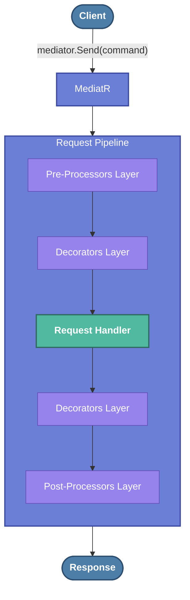
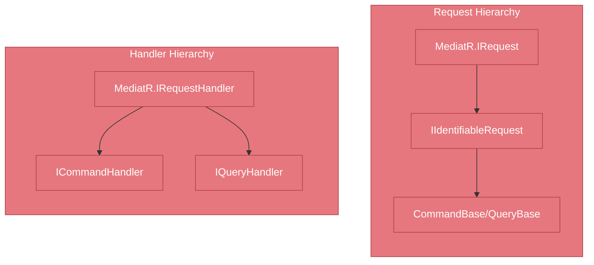

## This repository shows, how to implement CQRS architecture approach, using [Autofac](https://github.com/autofac/Autofac) and [MediatR](https://github.com/jbogard/MediatR) libraries.

The main purpose is to create a simple app with clear CQRS requests processing behavior.

This repository demonstrates how to:
 - Set up the **MediatR**
 - Create custom **Commands** / **Queries** and its handlers
 - Add **decorators** for all types of request handlers
 - Add **decorators** only for Command or Query handlers
 - Use **pipelines** (**MediatR** Behaviours like request Pre Processors and Post Processors)

The sample app output:

### The architecture [OBSOLETE - needs to be updated to MediatR 12.0]

